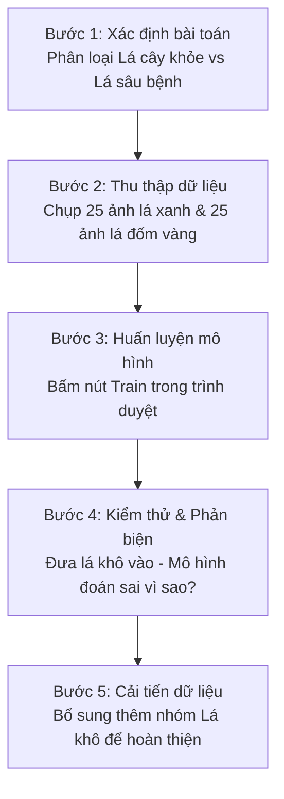

# Chapter 3: AI in Primary Education (Cấp Tiểu học: Lớp 1 – Lớp 5)

## Core Idea
Under Quyết định 2422/QĐ-BGDĐT, primary AI education emphasizes sensory exploration, intuitive discovery, and emotional boundaries. Instructional methods must be visual, lively, and closely tethered to children's daily lives (thẻ tranh, đóng vai, mô hình giấy, tài khoản dùng chung). Students learn that living humans possess genuine emotions while AI does not, observe how machines perceive the environment through sensors, train simple supervised classification models, and cultivate safe screen habits and privacy protection.

## Frameworks Introduced

- **Living Being vs. Smart Artifact Disambiguation (Phân biệt Sinh vật sống vs Thiết bị thông minh)**:
  - When to use: Grades 1–3 to prevent animistic projection or emotional dependency on voice assistants, talking toys, and virtual characters.
  - How:
    1. *Physiological Dimension*: Humans eat, breathe, grow, and feel real physical pain/emotions; machines operate on electrical power, batteries, and algorithmic instructions.
    2. *Emotional Dimension*: AI voice assistants simulate empathy via pre-recorded phrases or statistical text matching, but have zero consciousness, genuine feelings, or moral intent.
    3. *Origin & Control Dimension*: Humans are biological beings; smart devices are human-made artifacts programmed and controlled by humans.
  - Why it works / failure mode: Young children naturally attribute living qualities to interactive speech agents. Establishing this clear boundary safeguards children from emotional manipulation and over-reliance.

- **Sensory-to-Sensor Analogy Model (Mô hình Tương đồng Giác quan – Cảm biến)**:
  - When to use: Grades 2–4 when explaining machine perception.
  - How:
    - *Eyes $\rightarrow$ Camera / Optical Sensor*: Captures light and pixels.
    - *Ears $\rightarrow$ Microphone / Audio Sensor*: Detects sound vibrations and frequencies.
    - *Touch $\rightarrow$ Touchscreen / Pressure / Ultrasonic Sensor*: Measures physical contact, pressure, or distance.
    - *Brain $\rightarrow$ Processor / Algorithm*: Interprets sensor data according to pre-programmed rules or statistical patterns.
  - Why it works / failure mode: Grounds abstract computational perception in concrete bodily experiences familiar to elementary students.

- **Primary Didactic Principles (Phương pháp Giáo dục Tiểu học - QĐ 2422 Phần V.4)**:
  - When to use: Planning all classroom activities in Grades 1 to 5.
  - How:
    - *Direct Visual & Lively Experience*: Prioritize storytelling (kể chuyện), flashcards (thẻ tranh), roleplaying games (đóng vai), and tactile observation.
    - *Short Guided Sessions*: Keep activities brief (10–15 minute segments) with direct teacher supervision.
    - *Zero Mandatory Personal Accounts*: Absolute prohibition against requiring young children to register personal email accounts or use personal smartphones; use shared school equipment or paper simulations (mô hình giấy).
    - *Manual / Unplugged Fallback*: When computers or power are unavailable, teachers guide students through manual physical simulations.

---

## Detailed Curricular Content & Learning Outcomes (YCCĐ) by Grade

### LỚP 1 (Grade 1)

| Chủ đề (Theme) | Nội dung (Content) | Mã & Yêu cầu cần đạt (YCCĐ Codes & Standards) |
|---|---|---|
| **A. Tư duy lấy con người làm trung tâm** *(A1. Tính chủ động)* | Con người có cảm xúc, AI thì không | **1.A1.1.** Nêu được ví dụ về một số cảm xúc quen thuộc của con người (vui, buồn, giận dữ, sợ hãi, ngạc nhiên,…) qua các tình huống gần gũi trong cuộc sống và bước đầu nhận ra rằng con người có cảm xúc còn AI thì không. **1.A1.2.** Nêu được rằng AI có thể mô phỏng hoặc nhận diện cảm xúc của con người, chứ không trải nghiệm cảm xúc như con người. |
|  | AI thể hiện cảm xúc do con người lập trình | **1.A1.3.** Nêu được rằng việc AI thể hiện cảm xúc (ví dụ: cười, buồn, ngạc nhiên, tức giận trên màn hình hoặc qua giọng nói) là do con người lập trình hoặc thiết kế trước. **1.A1.4.** Nêu được một số ví dụ minh họa (như robot cười khi người dùng kể chuyện vui, hoặc trợ lí ảo nói “Tôi rất vui được giúp bạn”), và giải thích được rằng những biểu hiện này chỉ là phản ứng được lập trình sẵn. |
| **A. Tư duy lấy con người làm trung tâm** *(A2. AI vì sự tiến bộ của con người)* | Ý nghĩa cảm xúc mà AI thể hiện | **1.A2.1.** Nêu được các cách mà AI thể hiện cảm xúc qua hình ảnh, giọng nói hoặc hành vi (ví dụ: biểu tượng khuôn mặt vui, giọng nói thân thiện, hoặc lời chào dễ thương). **1.A2.MR1.** Nêu được rằng những biểu hiện này giúp AI giao tiếp tự nhiên hơn với con người, khiến người dùng cảm thấy thoải mái, gần gũi và dễ hợp tác hơn. *(Nội dung mở rộng)* |
|  | Nhận diện AI trong cuộc sống | **1.A2.2.** Nhận biết và kể tên được một số sản phẩm hoặc thiết bị có sử dụng trí tuệ nhân tạo (ví dụ: loa thông minh, điện thoại có trợ lí ảo, robot hút bụi, xe tự lái, camera nhận diện khuôn mặt, ứng dụng dịch ngôn ngữ…). **1.A2.3.** Mô tả được công dụng chính của từng sản phẩm và cách AI giúp sản phẩm hoạt động thông minh hơn (ví dụ: loa thông minh hiểu lệnh bằng giọng nói; robot hút bụi tự tìm đường và tránh chướng ngại vật). |
| **B. Đạo đức AI** *(B1. Khía cạnh đạo đức & B3. Trách nhiệm xã hội)* | Việc làm tốt và việc làm xấu | **1.B1.1.** Nêu được một số hành vi sử dụng AI có thể gây hại cho người khác. |
|  | Máy thông minh làm việc tốt | **1.B3.1.** Nhận biết được rằng không được phép sử dụng AI với mục đích làm hại người khác. **1.B3.2.** Nêu được ví dụ về việc con người sử dụng AI đúng cách, vì mục đích tốt đẹp. |
| **C. Kĩ thuật và ứng dụng AI** *(C1. Đặc điểm chính của AI)* | Nhận biết AI và ứng dụng AI | **1.C1.1.** Nhận biết được AI trong một số ví dụ cụ thể và đơn giản về AI. **1.C1.2.** Nhận diện được một số công cụ AI quen thuộc và phổ biến trên điện thoại hoặc máy tính bảng (ví dụ: trợ lí ảo, nhận diện khuôn mặt,…). |
|  | Chức năng và công cụ AI | **1.C1.3.** Nhận biết được các thiết bị thông minh có các bộ phận giống với bộ phận của con người (ví dụ: camera là “mắt” và micro là “tai” của các thiết bị đó). **1.C1.4.** Nhận biết được AI có khả năng hiểu các mệnh lệnh đơn giản của con người, trò chuyện theo kịch bản định sẵn. **1.C1.MR1.** Nhận biết được AI có khả năng xử lí hình ảnh nhận được để nhận diện các đồ vật. *(Mở rộng)* **1.C1.MR2.** Nhận biết được AI có khả năng xử lí âm thanh để phân biệt các loại âm thanh khác nhau. *(Mở rộng)* |
| **D. Thiết kế hệ thống AI** *(D1. Giải pháp & D2. Cải tiến)* | Máy thông minh học từ ví dụ | **1.D1.1.** Nêu được ví dụ về một tình huống mà AI “học” từ hình ảnh hoặc thông tin do con người cung cấp (ví dụ: AI học nhận biết con mèo, quả táo…). **1.D1.MR1.** Biết được rằng để AI trả lời đúng cần có nhiều ví dụ đúng và khác nhau để AI học. *(Mở rộng)* |
|  | Nhiều loại máy thông minh | **1.D2.1.** Nhận biết được rằng có loại máy thông minh chỉ làm được một việc (như nhận biết hình ảnh), có loại có thể làm nhiều việc khác nhau (như lắng nghe - trả lời, thực hiện theo lệnh…). **1.D2.2.** Xếp được một số máy thông minh vào hai nhóm: nhóm chỉ làm được một việc và nhóm làm được nhiều việc khác nhau. |

---

### LỚP 2 (Grade 2)

| Chủ đề (Theme) | Nội dung (Content) | Mã & Yêu cầu cần đạt (YCCĐ Codes & Standards) |
|---|---|---|
| **A. Tư duy lấy con người làm trung tâm** *(A1. Tính chủ động)* | Khi nào nên và không nên dùng AI | **2.A1.1.** Trình bày được một số tình huống trong cuộc sống mà AI có thể hỗ trợ con người hiệu quả (dịch ngôn ngữ, tìm kiếm thông tin nhanh, phát hiện lỗi chính tả, điều khiển thiết bị trong nhà,…). **2.A1.2.** Trình bày được một số tình huống trong cuộc sống mà không nên hoặc cần thận trọng khi sử dụng AI (khi AI có thể làm lộ thông tin cá nhân như khuôn mặt, địa chỉ, giọng nói; khi AI thay thế hoàn toàn con người dẫn đến sự thiếu trách nhiệm). |
|  | AI làm việc, con người kiểm soát | **2.A1.3.** Nêu được ví dụ cụ thể về tình huống cần con người giám sát AI (người lái xe vẫn cần quan sát khi xe tự lái hoạt động; bác sĩ cần kiểm tra lại kết quả do AI gợi ý). **2.A1.4.** Nêu được ví dụ cụ thể về thái độ đúng đắn khi sử dụng AI: biết tin tưởng vào công nghệ ở mức hợp lý, nhưng vẫn có trách nhiệm và sự kiểm soát của con người. |
| **A. Tư duy lấy con người làm trung tâm** *(A2. AI vì sự tiến bộ & A3. Công dân AI)* | AI trong gia đình & AI hỗ trợ mọi người | **2.A2.1.** Nêu được một số thiết bị hoặc ứng dụng trong gia đình có sử dụng AI (loa thông minh, robot hút bụi, điều hoà tự động điều chỉnh nhiệt độ, camera nhận diện người, tivi gợi ý chương trình). **2.A2.MR1.** Thực hành sử dụng một số thiết bị hoặc ứng dụng AI với sự giám sát, hỗ trợ của giáo viên. *(Mở rộng)* **2.A2.MR2.** Nêu được rằng không được sử dụng thiết bị AI mà không có sự giám sát của người lớn. *(Mở rộng)* **2.A2.2.** Nhận biết và kể tên được các thành viên trong gia đình mà AI có thể hỗ trợ. **2.A2.MR3.** Nêu được mục tiêu của AI trong gia đình là giúp cuộc sống tiện nghi, an toàn hơn và có nhiều thời gian cho nhau hơn. *(Mở rộng)* |
|  | Con người dạy AI qua tương tác | **2.A3.1.** Nhận biết được rằng mỗi lần con người nói chuyện, đặt câu hỏi, tìm kiếm, hoặc đưa ra lựa chọn với AI thì AI có thể ghi nhận dữ liệu để học hỏi cách con người suy nghĩ và phản hồi. **2.A3.MR1.** Nêu được vai trò quan trọng của con người trong việc “dạy” AI: phản hồi đúng, lịch sự, có trách nhiệm giúp AI học mẫu tích cực; dữ liệu sai lệch làm AI học sai. *(Mở rộng)* |
| **B. Đạo đức AI** *(B1. Khía cạnh đạo đức & B3. Trách nhiệm xã hội)* | Sự đối xử không công bằng | **2.B1.1.** Nhận biết được rằng AI đôi khi có thể thiên kiến, tức là đối xử không công bằng với một số nhóm người. **2.B1.MR1.** Nêu được ví dụ về các tình huống thể hiện sự thiên kiến của AI. *(Mở rộng)* **2.B1.MR2.** Giải thích được rằng nếu dữ liệu chưa đa dạng hoặc chưa công bằng thì AI có thể học theo cách thiên vị. *(Mở rộng)* |
|  | Của bạn và của tớ | **2.B3.1.** Kể được tên một số thứ là của riêng em và một số thứ là của người khác. **2.B3.2.** Nêu được ví dụ về quyền sở hữu đối với sản phẩm do con người hoặc AI tạo ra. **2.B3.MR1.** Phân biệt được thứ của mình với thứ của người khác trong một vài tình huống đơn giản. *(Mở rộng)* **2.B3.MR2.** Nêu được rằng muốn dùng thứ của người khác thì phải hỏi và được người đó đồng ý. *(Mở rộng)* |
| **C. Kĩ thuật và ứng dụng AI** *(C1. Đặc điểm & C3. Công nghệ AI)* | Cách AI học và học liệu của AI | **2.C1.1.** Giải thích được “dữ liệu” là những ví dụ (hình ảnh, âm thanh) mà con người dùng để dạy cho AI. **2.C1.MR1.** So sánh được ở mức độ cơ bản giữa cách học của con người và AI. *(Mở rộng)* |
|  | Sơ lược cách AI phân loại đồ vật | **2.C3.1.** Nhận biết được rằng AI có thể phân loại. **2.C3.2.** Nêu được rằng AI có thể phân loại sai. **2.C3.MR1.** Quan sát thao tác phân loại đồ vật do giáo viên thực hiện trên thiết bị điện tử hoặc mô phỏng; từ đó so sánh cách AI phân loại với cách con người phân loại. *(Mở rộng)* |
| **D. Thiết kế hệ thống AI** *(D1. Giải pháp & D2. Cải tiến)* | Máy thông minh giải quyết vấn đề | **2.D1.1.** Nêu được một số vấn đề đơn giản, gần gũi trong đời sống có thể áp dụng AI để giải quyết. **2.D1.2.** Nêu được một số ý tưởng máy thông minh. **2.D1.MR1.** Nêu một số ví dụ phù hợp để “dạy” AI trong một tình huống cụ thể. *(Mở rộng)* |
|  | Vai trò của dữ liệu | **2.D2.1.** Giải thích được cơ bản về vai trò của dữ liệu trong việc “dạy” AI trong một tình huống cụ thể. **2.D2.2.** Giải thích được rằng cần cung cấp cho AI dữ liệu chính xác, rõ ràng để AI đưa ra kết quả đúng. **2.D2.MR1.** Thực hành thu thập một số dữ liệu để “dạy” AI trong một tình huống cụ thể. *(Mở rộng)* |

---

### LỚP 3 (Grade 3)

| Chủ đề (Theme) | Nội dung (Content) | Mã & Yêu cầu cần đạt (YCCĐ Codes & Standards) |
|---|---|---|
| **A. Tư duy lấy con người làm trung tâm** *(A1. Tính chủ động & A2. Vì sự tiến bộ)* | Cách dùng AI trong học tập & Không phụ thuộc | **3.A1.1.** Nêu được cách dùng AI hỗ trợ học tập (tìm tài liệu, luyện từ mới ngoại ngữ). **3.A1.2.** Nhận biết được tác hại của việc phụ thuộc hoàn toàn vào AI; giải thích được vì sao học sinh cần tự làm bài tập để rèn luyện trí não. **3.A1.MR1.** Thực hành phân biệt bài tập tự làm và bài tập nhờ AI giải hộ. *(Mở rộng)* |
|  | Suy nghĩ kĩ trước khi dùng AI | **3.A2.1.** Trình bày được rằng trước khi dùng AI cần xác định mục đích rõ ràng. **3.A2.2.** Nhận diện được các ứng dụng AI trong trường học (camera điểm danh, phần mềm luyện phát âm). **3.A2.MR1.** Đưa ra được câu hỏi phản biện đối với kết quả do AI cung cấp (kiểm tra lại xem AI trả lời có đúng thực tế không). *(Mở rộng)* |
| **B. Đạo đức AI** *(B1. Khía cạnh đạo đức & B3. Trách nhiệm xã hội)* | Phân biệt thật và giả & Làm việc tốt | **3.B1.1.** Nhận biết được rằng trên mạng có những hình ảnh, âm thanh giả mạo do máy tính tạo ra. **3.B1.MR1.** Nêu được một số cách đơn giản để nhận biết hình ảnh giả mạo (chi tiết bàn tay thừa ngón, mắt biến dạng, ánh sáng bất thường). *(Mở rộng)* **3.B3.1.** Cam kết cùng bạn bè sử dụng máy tính và ứng dụng thông minh vào các việc làm có ích cho trường lớp. |
| **C. Kĩ thuật và ứng dụng AI** *(C1. Đặc điểm & C5. Kĩ thuật/Thuật toán)* | Dữ liệu học máy & AI dựa trên luật | **3.C1.1.** Giải thích được khái niệm tập mẫu (dữ liệu huấn luyện) thông qua trò chơi sắp xếp thẻ tranh. **3.C5.1.** Nhận biết được thuật toán AI dựa trên luật (quy tắc logic IF-THEN: "Nếu thấy màu đỏ thì dừng, nếu thấy màu xanh thì đi"). **3.C5.2.** Nhận biết được sự khác nhau giữa máy làm theo luật cố định và máy học từ dữ liệu. **3.C5.3.** Nêu được tình huống áp dụng học máy (phân loại rau củ trong nông trại thông minh, dự báo mưa lũ). **3.C5.4.** Nhận biết được bài toán học máy phân loại và bài toán dự đoán thông qua tình huống cụ thể. **3.C5.MR2.** Minh họa được bài toán phân loại bằng công cụ mã nguồn mở/miễn phí (Teachable Machine, ML for Kids trong Scratch). *(Mở rộng)* |
| **D. Thiết kế hệ thống AI** *(D1. Giải pháp & D2. Cải tiến)* | Quá trình huấn luyện & Dữ liệu tốt | **3.D1.1.** Trình bày được quá trình đơn giản để huấn luyện AI: thu thập ví dụ $\rightarrow$ cho AI học từ ví dụ. **3.D2.1.** Nêu được rằng dữ liệu dùng để dạy AI có thể bị thiếu, nhầm lẫn hoặc không đúng sự thật. **3.D2.2.** Nêu được một số yêu cầu cơ bản đối với dữ liệu huấn luyện AI. **3.D2.MR1.** Thực hành kiểm tra một bộ thẻ dữ liệu mẫu và loại bỏ được các thẻ gán nhãn nhầm, thẻ không đúng sự thật. *(Mở rộng)* **3.D2.3.** Trình bày được nếu dữ liệu sai hoặc không tốt thì AI sẽ không hiệu quả, thậm chí hoạt động sai. |

---

### LỚP 4 (Grade 4)

| Chủ đề (Theme) | Nội dung (Content) | Mã & Yêu cầu cần đạt (YCCĐ Codes & Standards) |
|---|---|---|
| **A. Tư duy lấy con người làm trung tâm** *(A1. Tính chủ động & A2. Vì sự tiến bộ)* | AI trong công việc hằng ngày & Con người suy nghĩ | **4.A1.1.** Trình bày được một số lĩnh vực cụ thể mà AI có thể hỗ trợ con người (nông nghiệp, y tế, giao thông,…). **4.A1.2.** Nhận biết được rằng AI được tạo ra để hỗ trợ con người học tập và làm việc hiệu quả hơn nhưng không thể thay thế tư duy, cảm xúc và sự sáng tạo của con người. **4.A1.MR1.** Nêu được ví dụ cụ thể về việc AI hỗ trợ học tập và giải thích được vì sao người học vẫn cần tự suy nghĩ, kiểm tra và hiểu bài thay vì chỉ chép kết quả do AI đưa ra. *(Mở rộng)* |
|  | AI vì cuộc sống & AI trong xã hội | **4.A2.1.** Nêu được rằng AI được con người tạo ra để hỗ trợ đời sống xã hội, giúp giải quyết vấn đề, tiết kiệm thời gian và nâng cao chất lượng cuộc sống. **4.A2.2.** Trình bày được các đối tượng trong xã hội AI có thể hỗ trợ: người lao động, người yếu thế (người khiếm thị, khiếm thính,…). |
|  | Con người quyết định khi dùng AI | **4.A3.1.** Trình bày được việc quyết định có dùng AI hay không phụ thuộc vào mục đích, nhu cầu và sự an toàn của con người. **4.A3.MR1.** Thực hành đưa ra quyết định có sử dụng AI hay không trong tình huống cụ thể: nếu an toàn, tiết kiệm thời gian thì chọn dùng; nếu rủi ro, xâm phạm quyền riêng tư hoặc đạo đức thì dừng sử dụng. *(Mở rộng)* |
| **B. Đạo đức AI** *(B2. Sử dụng an toàn)* | Bảo vệ thông tin cá nhân | **4.B2.1.** Nêu được một số loại thông tin cá nhân cần giữ bí mật và không nên chia sẻ cho AI (họ tên đầy đủ, ngày sinh, địa chỉ nhà, số điện thoại, mật khẩu). **4.B2.2.** Nêu được một số hậu quả khi thông tin cá nhân bị lộ hoặc bị lợi dụng. **4.B2.MR1.** Thực hành xử lí theo hướng dẫn một tình huống giả định đơn giản về việc bị lộ thông tin cá nhân khi dùng AI. *(Mở rộng)* |
| **C. Kĩ thuật và ứng dụng AI** *(C2. Ứng dụng & C5. Kĩ thuật/Thuật toán)* | Ứng dụng AI quen thuộc & Công cụ học máy trực quan | **4.C2.1.** Nêu được các ứng dụng của AI trong học tập và đời sống gần gũi với bối cảnh Việt Nam (nông nghiệp thông minh, dự báo lũ, dịch ngôn ngữ dân tộc). **4.C2.MR1.** Thực hành trải nghiệm một số ứng dụng AI trong học tập và đời sống. *(Mở rộng)* **4.C5.MR1.** Thực hiện lại được theo từng bước các thao tác cơ bản với công cụ trải nghiệm AI trực quan dựa trên học máy có giám sát (Teachable Machine, Scratch AI): (1) mở công cụ và đặt tên nhóm; (2) đưa vào mỗi nhóm một số hình ảnh mẫu; (3) bấm lệnh cho máy học; (4) đưa hình ảnh mới vào và quan sát kết quả. *(Mở rộng)* **4.C5.MR2.** Lặp lại đầy đủ 4 bước trên với bộ dữ liệu tự chọn khác và mô tả thao tác mỗi bước. *(Mở rộng)* |
| **D. Thiết kế hệ thống AI** *(D1. Giải pháp & D2. Cải tiến)* | Từ vấn đề đến ý tưởng AI & Liên tục cải tiến | **4.D1.1.** Nêu được một số ý tưởng ban đầu về cách AI có thể học hoặc giúp giải quyết vấn đề gắn với bối cảnh Việt Nam (phân loại rác tái chế). **4.D1.MR1.** Trình bày cách sử dụng AI giải quyết vấn đề trong tình huống cụ thể (AI học từ giọng nói, chữ viết của đồng bào dân tộc thiểu số để dịch sang tiếng phổ thông giúp học sinh vùng cao). *(Mở rộng)* **4.D2.1.** Trình bày được rằng con người cần liên tục đánh giá và nâng cấp sản phẩm để hệ thống AI cho ra kết quả tốt hơn. |

---

### LỚP 5 (Grade 5)

| Chủ đề (Theme) | Nội dung (Content) | Mã & Yêu cầu cần đạt (YCCĐ Codes & Standards) |
|---|---|---|
| **A. Tư duy lấy con người làm trung tâm** *(A1. Tính chủ động & A2. Vì sự tiến bộ)* | Con người chịu trách nhiệm & AI không thay thế | **5.A1.1.** Trình bày được AI có thể làm thay con người một số việc lặp đi lặp lại, nguy hiểm hoặc đòi hỏi chính xác cao (robot lắp ráp nhà máy, kiểm tra lỗi sản phẩm, xe tự lái chở hàng). **5.A1.2.** Nêu ví dụ cụ thể về trách nhiệm của người tạo và sử dụng AI (bác sĩ phải kiểm tra lại khi AI chẩn đoán nhầm bệnh và chịu trách nhiệm điều chỉnh). **5.A1.MR1.** Trình bày được con người chịu trách nhiệm cuối cùng về mọi quyết định hoặc kết quả do AI tạo ra. *(Mở rộng)* **5.A2.1.** Giải thích được mục đích chính của AI là hỗ trợ con người, chứ không thay thế vai trò, tư duy, cảm xúc và trách nhiệm của con người. **5.A2.MR1.** Trình bày được chỉ con người mới có khả năng suy nghĩ sáng tạo, thấu hiểu cảm xúc và ra quyết định đạo đức; con người luôn kiểm soát và định hướng AI. *(Mở rộng)* **5.A2.2.** Trình bày AI phục vụ lợi ích chung của xã hội, cải thiện chất lượng cuộc sống. **5.A2.3.** Nêu ví dụ cụ thể AI mang lại lợi ích cho cộng đồng trong y tế, giáo dục, môi trường. |
|  | Con người trong kỉ nguyên AI | **5.A3.1.** Trình bày được mọi người (trẻ em, người lớn, người cao tuổi) đều cần hiểu và biết cách sử dụng AI an toàn, hiệu quả. **5.A3.2.** Trình bày việc sử dụng AI phải phù hợp nhu cầu, tránh lạm dụng hoặc tin tưởng tuyệt đối. **5.A3.MR1.** Trình bày ý tưởng về tình huống tương lai AI hỗ trợ người cao tuổi hoặc trẻ em. *(Mở rộng)* |
| **B. Đạo đức AI** *(B1. Khía cạnh đạo đức, B2. An toàn & B3. Trách nhiệm)* | Hệ thống AI công bằng & Giúp AI công bằng | **5.B1.1.** Nêu ví dụ về sự công bằng hoặc không công bằng trong đời sống và khi AI phục vụ con người. **5.B1.2.** Giải thích được rằng AI cần phục vụ con người công bằng, không phân biệt giới tính, vùng miền, kinh tế hay hoàn cảnh. **5.B2.1.** Nêu một số cách giúp AI hoạt động công bằng hơn (sử dụng dữ liệu đa dạng, tránh định kiến, kiểm tra lại kết quả do AI tạo ra). **5.B2.MR1.** Đề xuất một số quy tắc thu thập dữ liệu để có được bộ dữ liệu đa dạng. *(Mở rộng)* **5.B3.1.** Giải thích vì sao con người cần hiểu cách AI đưa ra quyết định nhằm đảm bảo tính minh bạch và độ tin cậy. |
| **C. Kĩ thuật và ứng dụng AI** *(C5. Kĩ thuật và thuật toán AI)* | Thuật toán AI dựa trên luật & Học máy trực quan | **5.C5.1.** Nêu được cách sử dụng cấu trúc "nếu … thì …" (IF-THEN) trong lập trình AI đơn giản. **5.C5.MR1.** Thực hành sử dụng cấu trúc "nếu … thì …" trong lập trình AI đơn giản. *(Mở rộng)* **5.C5.2.** Thực hiện được các thao tác cơ bản với công cụ trải nghiệm AI trực quan dựa trên học máy có giám sát (Teachable Machine, ML for Kids trong Scratch). **5.C5.MR2.** Huấn luyện được mô hình phân loại đơn giản trên công cụ trực quan (ví dụ: phân loại lá cây khoẻ – lá cây bị sâu bệnh). *(Mở rộng)* **5.C5.MR3.** Kiểm tra được kết quả do mô hình đưa ra, chỉ ra được những trường hợp mô hình phân loại sai. *(Mở rộng)* |
| **D. Thiết kế hệ thống AI** *(D1. Giải pháp & D2. Cải tiến)* | Quy trình huấn luyện AI & Cải tiến bằng dữ liệu | **5.D1.1.** Mô tả được ở mức đơn giản các bước cơ bản trong quá trình huấn luyện mô hình AI: (1) xác định vấn đề, (2) thu thập dữ liệu, (3) dạy máy học, (4) kiểm tra và đánh giá kết quả. **5.D1.MR1.** Thực hành thu thập dữ liệu nhằm huấn luyện mô hình AI giải quyết vấn đề đơn giản. *(Mở rộng)* **5.D2.1.** Giải thích được bằng ví dụ rằng hệ thống AI có thể được cải tiến và hoạt động tốt hơn khi dữ liệu được bổ sung và cập nhật thường xuyên. **5.D2.MR1.** Thực hành cải tiến hệ thống AI bằng cách bổ sung dữ liệu. *(Mở rộng)* |

---

## Pedagogical Anti-patterns in Primary AI

- **Anthropomorphic Framing**: Teachers calling AI "bạn Robot thông minh" or saying "máy tính đang nghĩ rằng..." instead of "máy tính tính toán dựa trên dữ liệu mẫu".
- **Mandatory Individual Accounts**: Forcing 8-year-olds to register individual Gmail or commercial accounts, violating national child privacy regulations.
- **Purely Demonstrative Teaching**: The teacher operating the tool on a projector while 35 students sit passively without touching physical flashcards, manipulatives, or web tools.

## Worked Example: 4-Step Primary Lab on Fruit Health Classification (Grade 5)
- **Target Codes**: `5.C5.MR2`, `5.C5.MR3`, `5.D1.1`, `5.D2.MR1`.
- **Tool**: Google Teachable Machine (Client-side, shared computer lab).
- **Duration**: 35 minutes (1 standard primary period).

## Key Takeaways
1. **Human emotion is unique**: Living humans feel and create; AI calculates statistical patterns from human training data.
2. **Data diversity prevents machine unfairness**: If training examples lack variety, the smart system makes unfair or erroneous decisions.
3. **Safety and privacy are non-negotiable**: Personal identities, home addresses, and faces must never be freely uploaded to unknown online systems.
4. **Hands-on, sensory didactics**: Primary students learn best through tangible flashcards, roleplay, and zero-account visual simulators.

## Connects To
- **Ch 1**: Integrates into Primary Informatics (Lớp 3–5 bắt buộc, Lớp 1–2 tự chọn).
- **Ch 2**: Grounding level of the National AI Curriculum concentric spiral.
- **Ch 4**: Feeds directly into lower secondary formal data pipelines, feature engineering, and CV/NLP concepts.
- **Ch 6**: Guided by the primary-tier pedagogical and process assessment principles of QĐ 2422.
